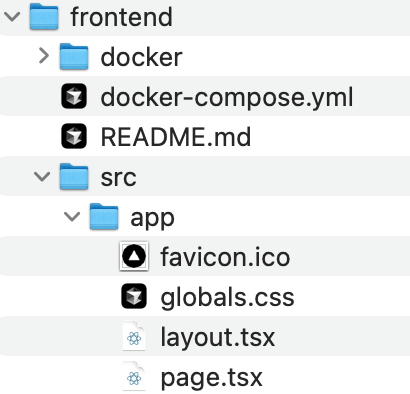

## 環境構築手順(macを想定)
0. 完成後のツリー<br>


1. 本リポジトリをクローン（ディレクトリ名は任意、画像はfrontend）
2. srcディレクトリを作成
3. srcディレクトリ内にソースリポジトリをクローン
4. ローカル端末にて下記コマンドを実行
``` 
# 本リポジトリの階層へ移動
cd $path_to_this_repository
# コンテナのビルド、起動
docker-compose build
docker-compose up -d
```
5. 下記にアクセスし、ページが表示されれば完了<br>
http://localhost:3030
